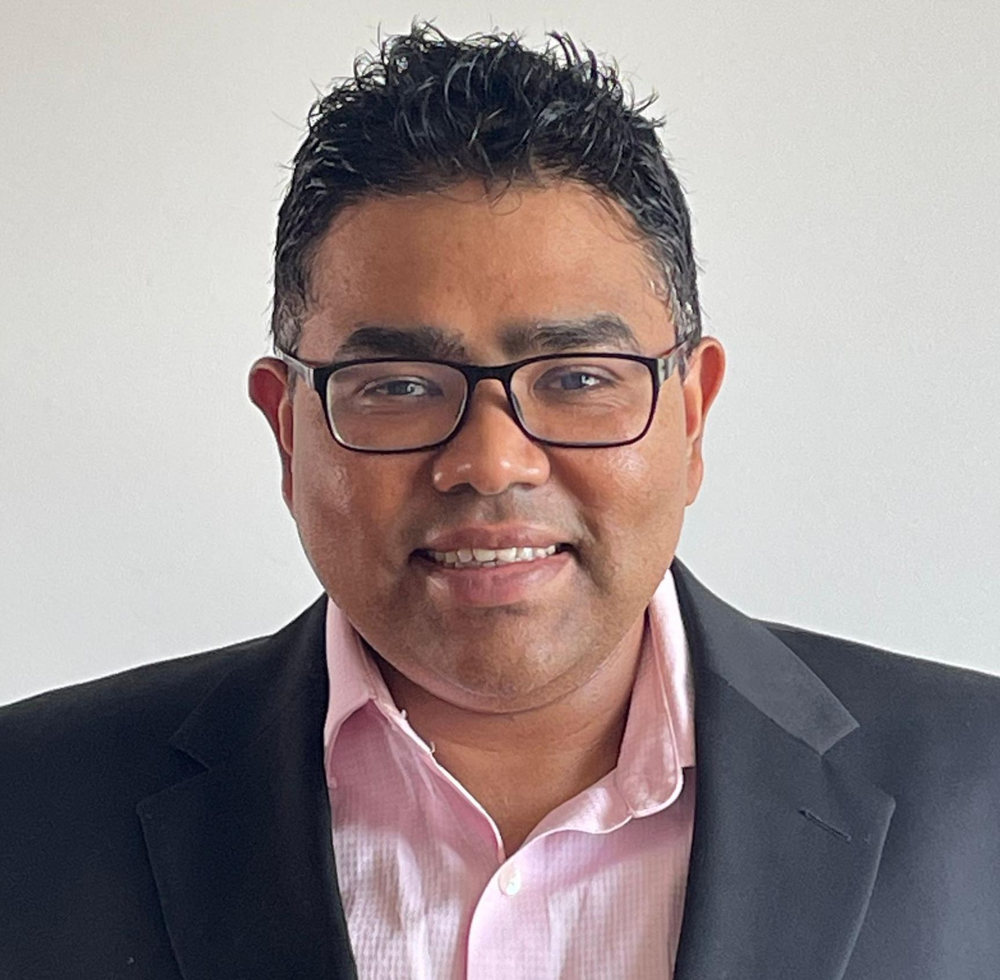

# Dr.-Ing. Aravindh Krishnamoorthy

  
  
(2026)

Senior wireless systems and signal-processing engineer with 20+ years of experience across Ericsson, Philips Semiconductors, Fraunhofer IIS, and Friedrich-Alexander-University of Erlangen-Nürnberg. Presently employed  at the **LiFi Research and Development Centre, University of Cambridge, UK.** Experience spans wireless 2/4/5G PHY algorithm design, MIMO systems, DSP implementation, numerical linear algebra, embedded optimisation, optical wireless systems, quantum communication interface design, and 3GPP/IEEE standardisation. Track record includes standards contributions, deployed DSP-oriented designs, prototype systems, granted patents, recent patent filings, open-source numerical software contributions, and collaboration across research, product, and industry ecosystems.

### Core Expertise

- Wireless PHY algorithm design; 5G/6G systems and standardisation; 3GPP RAN1; IEEE 802.11; MIMO and massive MIMO; DSP and embedded implementation; fixed- and floating-point numerical methods; linear algebra and optimisation; optical wireless communication; scientific computing; Julia, Python, MATLAB, Mathematica, and C/C++.
- Research on system and algorithm design for radio frequency and optical systems, linear algebra, and information and communication theories.

### Selected Career Highlights

- Contributed to 2G, 4G, 5G, and ongoing 6G standardisation work across Ericsson, Fraunhofer IIS, and the University of Cambridge, including 3GPP RAN1 and IEEE 802.11 activities.
- Designed, dimensioned, and implemented physical-layer and numerical software components for embedded DSP and vector-processor platforms in telecom and consumer electronics products.
- Led system design and demonstration of optical MIMO communication and optical positioning concepts.
- Built technical links between academic research, industry stakeholders, 5GAA, and ETSI ISGs to align research outputs with standards and deployment priorities.
- Generated patents in both industrial and university environments, including research carried out under tight academic resource constraints.
- Contributed to open source and open research, including numerical algorithms and bug fixes to LAPACK, GNU Octave, R, NumPy, Julia, and Mathics3.

Contact: [aravindh.krishnamoorthy@alumni.fau.de](mailto:aravindh.krishnamoorthy@alumni.fau.de) (will be forwarded to the current address)

## News

- [Mathematics Blog](https://aravindh-krishnamoorthy.github.io/ark-math/), with a chapter on [Errata for my publications](https://aravindh-krishnamoorthy.github.io/ark-math/Ch4.html)
- [Current open source profile including pinned projects on GitHub](https://github.com/aravindh-krishnamoorthy)

## Quick Links

- Research: [ORCID](https://orcid.org/0000-0001-7186-121X), [arXiv preprints](https://arxiv.org/a/krishnamoorthy_a_1.html), [IEEE Xplore Profile](https://ieeexplore.ieee.org/author/37086238080)
- Aggregated data: [Google Scholar](https://scholar.google.com/citations?user=eLf3E1kAAAAJ&hl=en), [Google Patents](https://patents.google.com/?inventor=aravindh+krishnamoorthy), [Fraunhofer Publications](http://publica.fraunhofer.de/autoren/Krishnamoorthy,%20A)
- Open-source programming: [GitHub](https://github.com/aravindh-krishnamoorthy), [GitLab](https://gitlab.com/aravindh.krishnamoorthy), [MathWorks File Exchange](https://www.mathworks.com/matlabcentral/profile/authors/3862426)
- Blogging: [Mathematics Blog](https://aravindh-krishnamoorthy.github.io/ark-math/), [Casual Blog](http://aravindhk.blogspot.com/)

## Personal Life

- Hobbies: Hiking, biking, rally racing, winter swimming, competitive mathematics
- Meritorious with $> 99.5$ percentile in several national and international competitive exams since childhood
- Numerous awards and scholarships during studies
- Recognized contributions to several open source software

## Curriculum Vitae

### Professional Experience

#### Post-Doctoral Research Associate, University of Cambridge

Dec 2024 – Jun 2026. Cambridge, United Kingdom.

- Contribute to 3GPP 6G RAN1 and IEEE 802.11 standardisation activities within the Federated Telecoms Hubs programme.
- Build two-way engagement between academic researchers, industry stakeholders, 5GAA, and ETSI ISGs to align research outputs with standards priorities and industrial relevance.
- Work on ELC, waveform design, MIMO, beam management, and quantum optical interfaces.
- Led system design and demonstration of optical MIMO communication and optical positioning using novel techniques; two patents filed.
- Investigate optical codecs using spiking neural networks and neuromorphic processors.
- Design and evaluate concepts for quantum optical interfaces through analysis, simulation, and system-level modelling.
- Developed two novel quantum communications concepts supporting proposal submissions totalling GBP 800K.
- Member of ETSI ISGs on Multiple Access Techniques and Quantum Technologies.

#### Research Staff, Friedrich-Alexander-University of Erlangen-Nürnberg

Jan 2019 – Jun 2024. Erlangen, Germany.

- Researched and developed precoding, decoding, and multiple-access schemes for MIMO and massive MIMO systems, including NOMA, RSMA, and linear precoding.
- Worked on distributed baseband signal-processing algorithms for wireless systems.
- Led research and prototype development for a high-speed optical wireless link in collaboration with the LiFi Research and Development Centre, the University of Strathclyde, and the University of Cambridge.
- Applied linear algebra, finite-size random matrix theory, numerical optimisation, and numerical analysis to communications-system design problems.
- Generated two patents from university research in a resource-constrained academic environment.

#### Research Staff, Fraunhofer Institute for Integrated Circuits IIS

Jan 2016 – Dec 2020. Erlangen, Germany. 20% part-time since Jan 2019.

- Contributed to research and development of the Shared UE-Side Distributed Antenna System (SUDAS) as a candidate concept for beyond-5G and 6G systems.
- Contributed to 5G standardisation activities.
- Developed and evaluated algorithms on the OpenAirInterface (OAI) 4G/5G emulator.
- Supervised master’s thesis and internship students and coordinated collaboration with Bilkent University.

#### Design Engineer / Technical Leader, Ericsson and Philips Semiconductors

Jul 2003 – Aug 2014. Bangalore, India; Nuremberg, Germany.

Wireless and communication systems:

- Estimated, dimensioned, and partitioned physical-layer algorithms from the DSP perspective, including vectorisation and implementation planning.
- Contributed to 3GPP RAN1 activities and backend design and simulation for 2G and 4G standardisation.
- Designed and developed LTE and GSM physical-layer algorithms for the in-house embedded vector processor (EVP).
- Performed numerical analysis of signal-processing algorithms to support robust fixed- and floating-point implementation.
- Designed and implemented fixed- and floating-point matrix libraries for the EVP, including matrix decompositions and inversion routines.
- Completed a long-term deputation to Research Triangle Park, Raleigh-Durham, United States.

Television audio systems:

- Designed and developed fixed-point audio decoders and multiple audio signal-processing components for the in-house TriMedia DSP.
- Architected and developed a real-time audio-streaming platform for televisions, including audio-video synchronisation.
- Completed long-term deputations to Eindhoven, San Jose, and Southampton.

### Education

#### Doctorate in Communications Engineering

2019 – 2024. Friedrich-Alexander University of Erlangen-Nürnberg, Erlangen, Germany.

- Degree: Dr.-Ing.
- Grade: 1.0, highest grade, with distinction.
- Thesis: Orthogonal and Non-orthogonal Precoding and Decoding Schemes for 5G and Beyond Downlink MIMO Communication Systems.

#### Master’s in Communications and Multimedia Engineering

2012 – 2015. Friedrich-Alexander-University of Erlangen-Nürnberg, Erlangen, Germany.

- Grade: 1.7.
- Thesis: Windowing Schemes for Robust Speech Coding in Packet Loss Scenarios.

#### Bachelor’s in Electrical and Electronics Engineering

1999 – 2003. Sir M. Visvesvaraya Institute of Technology, Bangalore, India.

- Grade: 80%; first class with distinction.
- Thesis: Clone Remote Control: An Embedded Real-Time Infrared Capture and Replay System.

### Selected Publications and Patents

- A. Krishnamoorthy and R. Schober, “Uplink and Downlink MIMO-NOMA With Simultaneous Triangularization,” *IEEE Transactions on Wireless Communications*, Jun. 2021. Introduced a simultaneous triangularization approach showing full multiplexing gain in overloaded MIMO-NOMA systems.
- A. Krishnamoorthy and R. Schober, “Downlink MIMO-RSMA With Successive Null-Space Precoding,” *IEEE Transactions on Wireless Communications*, Nov. 2022. Introduced a successive null-space precoding approach for robust performance in underloaded and critically loaded MIMO-RSMA systems.
- A. Krishnamoorthy, Z. Ding, and R. Schober, “Precoder Design and Statistical Power Allocation for MIMO-NOMA via User-Assisted Simultaneous Diagonalization,” *IEEE Transactions on Communications*, vol. 69, no. 2, pp. 929–945, Feb. 2021. Developed a matrix decomposition enabling exact rate analysis for Gaussian channels.
- A. Krishnamoorthy and R. Schober, “Downlink Massive MU-MIMO With Successively-Regularized Zero Forcing Precoding,” *IEEE Wireless Communications Letters*, Jan. 2023. Proposed a low-complexity linear precoding scheme for closely spaced users with correlated channels.
- A. Krishnamoorthy, R. Schober, and M. Breiling, “SUDAS, URU and base station,” U.S. Patent No. 12,382,549, 5 Aug. 2025. Outdoor-to-indoor relaying from sub-6 GHz to mmWave.
- A. Krishnamoorthy, R. Bachl, and T. Wagner, “Channel estimation for a subset of resource elements of a resource block,” U.S. Patent No. 9,860,764, 2 Jan. 2018. OFDM channel estimation for low-delay-spread channels.
- A. Krishnamoorthy, “Processing of channel coefficients of a network,” U.S. Patent No. 9,191,240, 17 Nov. 2015. DSP-based mitigation of on-silicon clock leakage.

For a complete list of filed and granted patents as well as publications, see the Google Scholar profile linked above.

### Additional Information

- Programming: Julia, Python, Mathematica, MATLAB, C/C++.
- Languages: German (C1), English.
